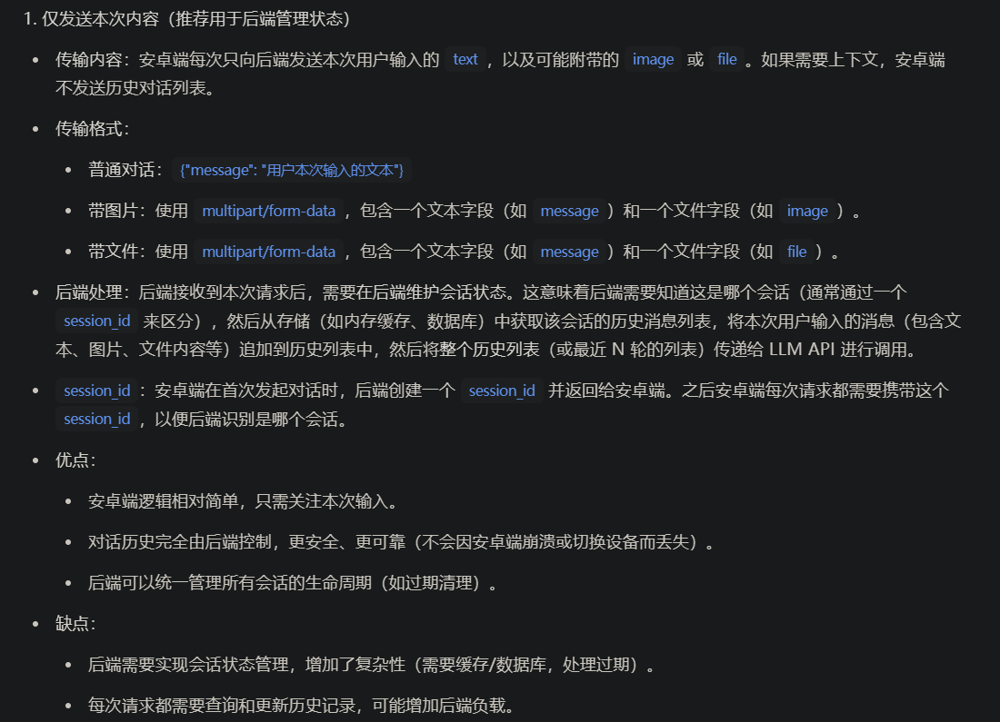

# LLMChat-AndroidApplication

---

#### 总体预期达到的目标

#### 自问自答环节

**Q:1.怎么将文件以及图片添加至对话的上下文**

A:文本转 Token，图片转特征向量

**Q:2.安卓端与后端怎么进行交互**

A:

**Q:3.对于以往的某一次对话是怎么处理的**

A:仅关注本轮对话以及最近的对话历史，以往的每一次对话仅保留而不能接续

**Q:4.怎么让仅能接受文本的 llm-api 接口理解文件以及图片**

A:将本轮涉及到的所有文件以及文件存储在同一个向量数据库中

#### 待开发功能

- [x] 将与 llm_chat 的部分提取成 一个完整的后端

- [ ] 丰富对话主页面的设置

  - [ ] 对话列表的标题由大模型生成

  - [x] 系统提示词添加至历史对话中

  - [x] 清除当前对话的上下文[内存以及数据库记录]

  - [x] 上传文件[word,pdf,txt等其他二进制文件以及纯文本文件,不包括 图片]

  - [x] 将`文件`以及`图片`添加至对话的上下文
  
  - [ ] ~~点击文件、图片缩略图来查看内容详情~~
- [ ] 增添对话列表的设置功能

  - [ ] ~~自由配置 OpenAI 风格的大模型的 Base-Url 与 Key~~
- [ ] 其他待开发功能

  - [x] `图像识别功能`

  - [ ] `语音识别功能`
  
  - [x] `文本转语言功能`
  
  - [ ] ~~打开相机，拍摄并上传图片~~
- [x] 将 现有的 LLM_API_CLIENT 类改造成可以调用工具的 AGENT 类

### 后端项目地址

https://github.com/huahuo156/LLMChatBackend.git